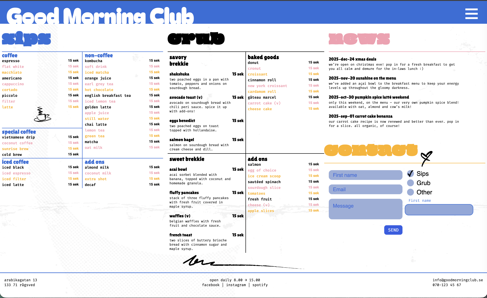

# Good Morning Club – HTML & SCSS

Detta projekt är en responsiv webbplats skapad med **HTML5** och **SCSS** enligt given design.

---

## Tekniker
- HTML5 (semantisk struktur)
- SCSS
- CSS Grid & Flexbox  
- Inga JavaScript-ramverk

---

## Tillgänglighet & Semantik
Sidan är byggd med semantiska HTML-element och har granskats ur ett tillgänglighetsperspektiv.

---

## Lighthouse
Lighthouse-rapport (GitHub Pages):
- Performance: 96  
- Accessibility: 94  
- Best Practices: 100  
- SEO: 91  

📸 Skärmdump:

---

## Skärmdumpar

**Desktop**

**Mobil**

---

## Publicerad version
https://medieinstitutet.github.io/fed25d-html-css-inl-2-design-alexgeho/

---

Skapad av **Alexander Gerhard**
